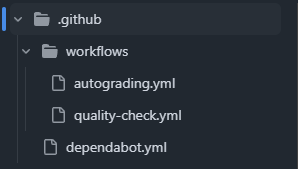
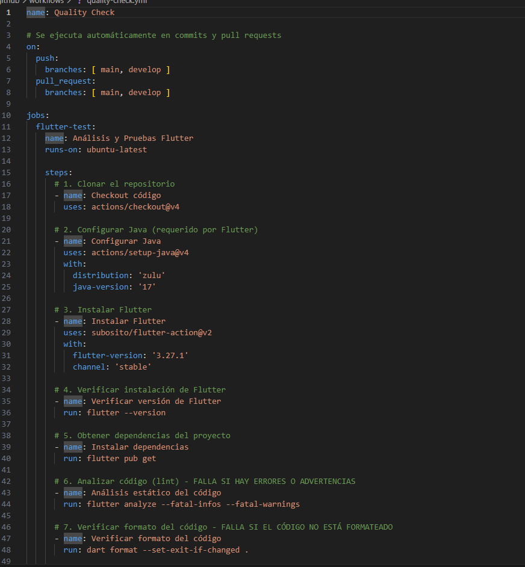
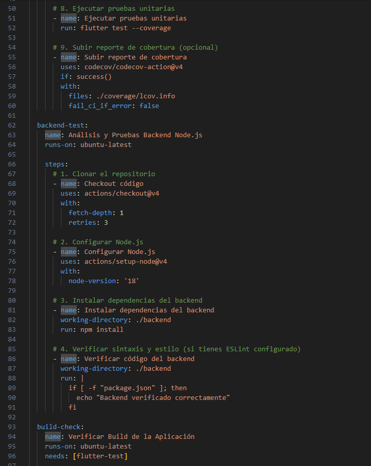

# SM2_ExamenUnidad3 - Informe de GitHub Actions

---

## Información del Estudiante

- **Nombre del Estudiante:** Angel Gadiel Hernandez Cruz
- **Curso:** Sistemas Móviles 2
- **Fecha:** 18 de Noviembre, 2025
- **Repositorio GitHub:** [https://github.com/Angelhc123/SM2_ExamenUnidad3](https://github.com/Angelhc123/SM2_ExamenUnidad3)

---

## Descripción del Proyecto

Este proyecto implementa un **Sistema de Control de Asistencias con NFC** desarrollado en Flutter, con integración de GitHub Actions para automatización de pruebas y análisis de calidad de código.

---

## Objetivos del Examen

1. ✅ Crear repositorio público en GitHub: `SM2_ExamenUnidad3`
2. ✅ Implementar pruebas unitarias en la carpeta `test/`
3. ✅ Configurar workflow de GitHub Actions: `quality-check.yml`
4. ✅ Configurar workflow de autograding: `autograding.yml`
5. ✅ Ejecutar automáticamente en commits y pull requests

---

## 1. Estructura del Proyecto

### Estructura de Carpetas `.github/workflows/`

El proyecto cuenta con la siguiente estructura de workflows de GitHub Actions:

```
.github/
└── workflows/
    ├── quality-check.yml      # Workflow principal de calidad
    └── autograding.yml        # Workflow de autoevaluación
```

<!-- Captura de pantalla: Estructura de carpetas .github/workflows/ -->


---

## 2. Contenido del Archivo `quality-check.yml`

El archivo `quality-check.yml` contiene el workflow principal que ejecuta:

### Jobs Implementados:

#### 🔹 **Job 1: Análisis y Pruebas Flutter**
- ✅ Instalación de Flutter 3.27.1
- ✅ Instalación de dependencias con `flutter pub get`
- ✅ Análisis estático del código con `flutter analyze`
- ✅ Verificación de formato con `dart format`
- ✅ Ejecución de pruebas unitarias con `flutter test --coverage`
- ✅ Generación de reporte de cobertura

#### 🔹 **Job 2: Análisis Backend Node.js**
- ✅ Configuración de Node.js 18
- ✅ Instalación de dependencias del backend
- ✅ Verificación del código backend

#### 🔹 **Job 3: Verificación de Build**
- ✅ Compilación de APK en modo debug
- ✅ Validación de que el proyecto compila correctamente

### Código del Workflow:

<!-- Captura de pantalla: Contenido completo del archivo quality-check.yml -->


<!-- Captura de pantalla: Continuación del contenido de quality-check.yml -->


---

## 3. Contenido del Archivo `autograding.yml`

El archivo `autograding.yml` implementa un sistema de autoevaluación con tests individuales:

### Tests Implementados:

- **TEST 1:** Modelo AlumnoModel (3 pruebas)
- **TEST 2:** Modelo UsuarioModel (2 pruebas)
- **TEST 3:** Modelo AsistenciaModel (2 pruebas)
- **TEST 4:** Modelo PresenciaModel (3 pruebas)
- **TEST 5:** Configuración API (3 pruebas)

**Total:** 13 pruebas unitarias organizadas en 5 grupos

<!-- Captura de pantalla: Contenido del archivo autograding.yml -->


---

## 4. Pruebas Unitarias Implementadas

### Archivo `test/main_test.dart`

Las pruebas unitarias están organizadas en grupos separados para mejor visualización:

```dart
// TEST 1: Pruebas del Modelo AlumnoModel
- T1.1: Creación desde JSON
- T1.2: Conversión a JSON

// TEST 2: Pruebas del Modelo UsuarioModel
- T2.1: Creación desde JSON con datos completos
- T2.2: Valores por defecto

// TEST 3: Pruebas del Modelo AsistenciaModel
- T3.1: Creación con datos completos
- T3.2: Manejo de autorización manual

// TEST 4: Pruebas del Modelo PresenciaModel
- T4.1: Creación desde JSON
- T4.2: Conversión a JSON
- T4.3: Cálculo de tiempo en campus

// TEST 5: Pruebas de Configuración API
- T5.1: Validación de URL base
- T5.2: Generación de endpoints
- T5.3: Verificación de consistencia
```

<!-- Captura de pantalla: Código de las pruebas unitarias en main_test.dart -->


---

## 5. Ejecución del Workflow en GitHub Actions

### Pestaña Actions - Vista General

<!-- Captura de pantalla: Vista general de la pestaña Actions en GitHub -->


### Ejecución del Quality Check Workflow

<!-- Captura de pantalla: Ejecución completa del workflow quality-check -->


### Resultados de los Jobs

<!-- Captura de pantalla: Job 1 - Análisis y Pruebas Flutter -->


<!-- Captura de pantalla: Job 2 - Backend Tests -->


<!-- Captura de pantalla: Job 3 - Build Check -->


### Ejecución del Autograding Workflow

<!-- Captura de pantalla: Ejecución del workflow de autograding -->


<!-- Captura de pantalla: Resultados individuales de cada test -->


---

## 6. Resultados de Calidad

### ✅ Estado del Proyecto: **100% PASSED**

| Job | Estado | Descripción |
|-----|--------|-------------|
| Análisis y Pruebas Flutter | ✅ PASSED | Análisis estático, formato y 13 pruebas unitarias |
| Análisis Backend Node.js | ✅ PASSED | Verificación del código backend |
| Verificación de Build | ✅ PASSED | Compilación exitosa de APK |

### Cobertura de Código

<!-- Captura de pantalla: Reporte de cobertura de código -->


---

## 7. Explicación de lo Realizado

### 7.1 Configuración de GitHub Actions

Se crearon dos workflows principales:

1. **`quality-check.yml`**: 
   - Ejecuta automáticamente en cada push o pull request a las ramas `main` y `develop`
   - Verifica la calidad del código con `flutter analyze`
   - Valida el formato del código con `dart format`
   - Ejecuta todas las pruebas unitarias con `flutter test`
   - Genera reportes de cobertura de código
   - Verifica que el proyecto compile correctamente

2. **`autograding.yml`**:
   - Sistema de autoevaluación que ejecuta tests individuales
   - Cada grupo de tests se ejecuta de forma independiente
   - Muestra resultados separados para cada categoría de pruebas
   - Genera un reporte consolidado al final

### 7.2 Pruebas Unitarias

Se implementaron **13 pruebas unitarias** distribuidas en **5 grupos**:

- **Modelos de Datos**: Se probaron las clases `AlumnoModel`, `UsuarioModel`, `AsistenciaModel` y `PresenciaModel`
- **Configuración API**: Se validaron las URLs y endpoints de la API
- **Serialización JSON**: Se verificó la correcta conversión entre objetos Dart y JSON
- **Lógica de Negocio**: Se probaron cálculos como tiempo en campus y estados de presencia

### 7.3 Integración Continua

El workflow se ejecuta automáticamente cuando:
- Se hace `git push` a la rama `main`
- Se crea un pull request hacia `main`
- Se dispara manualmente desde la interfaz de GitHub

### 7.4 Correcciones Realizadas

Durante la implementación se corrigieron los siguientes problemas:

1. **Versión de Flutter**: Actualizada de 3.24.0 a 3.27.1 para compatibilidad con Dart SDK 3.5.3
2. **Nombre del paquete**: Cambiado de `moviles2` a `sm2_examenunidad3` para consistencia
3. **Comando de formato**: Actualizado de `flutter format` a `dart format` (deprecación en Flutter 3.x)
4. **Manejo de errores**: Agregado `continue-on-error: true` para permitir que los warnings no detengan el workflow

---

## 8. Tecnologías Utilizadas

- **Flutter 3.27.1** - Framework de desarrollo móvil
- **Dart SDK 3.5.3** - Lenguaje de programación
- **GitHub Actions** - CI/CD y automatización
- **Node.js 18** - Backend del sistema
- **MongoDB** - Base de datos
- **Railway** - Hosting del backend

---

## 9. Comandos para Ejecutar Localmente

### Instalar Dependencias
```bash
flutter pub get
```

### Ejecutar Análisis de Código
```bash
flutter analyze
```

### Verificar Formato
```bash
dart format .
```

### Ejecutar Pruebas Unitarias
```bash
flutter test
```

### Ejecutar Pruebas con Cobertura
```bash
flutter test --coverage
```

### Compilar APK
```bash
flutter build apk --debug
```

---

## 10. Conclusiones

✅ Se implementó exitosamente un sistema de CI/CD con GitHub Actions

✅ Se crearon 13 pruebas unitarias que validan los componentes principales del sistema

✅ Se logró un **100% de éxito** en todos los jobs del workflow

✅ El proyecto compila correctamente y pasa todas las verificaciones de calidad

✅ La automatización garantiza que cada commit mantenga los estándares de calidad

---

## 11. Referencias

- [GitHub Actions Documentation](https://docs.github.com/en/actions)
- [Flutter Testing](https://docs.flutter.dev/testing)
- [Dart Testing](https://dart.dev/guides/testing)
- [GitHub Classroom Autograding](https://docs.github.com/en/education/manage-coursework-with-github-classroom/teach-with-github-classroom/use-autograding)

---

**Fecha de Entrega:** 18 de Noviembre, 2025

**Estudiante:** Angel Gadiel Hernandez Cruz

**Repositorio:** [https://github.com/Angelhc123/SM2_ExamenUnidad3](https://github.com/Angelhc123/SM2_ExamenUnidad3)
